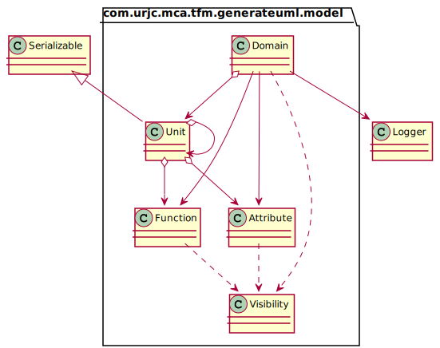
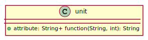
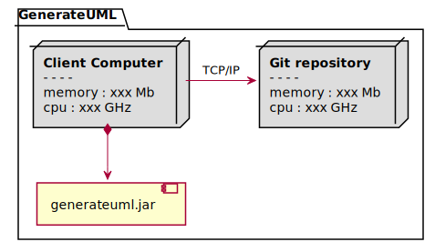

# Generate UML

## Descripción del proyecto
1. Introducción
2. Creación de un modelo de dominio
3. Generar documentación
4. Ingeniería inversa

---
### Introducción
Este trabajo surge con la idea de poder agilizar la creación de documentación UML para el diseño arquitectónico de aplicaciones. Así como el análisis de su evolución.

Actualmente una de las maneras de generar documentación UML es mediante la herramienta de código abierto PlantUML, que consiste en un lenguaje de texto sin formato que interpretado por el servidor de PlantUML, nos genera el diagrama UML que hayamos creado con este lenguaje.

El crear documentación UML mediante este sistema es costoso en tiempo, ya que modelar la arquitectura de una aplicación de cierto tamaño requiere de mucho tiempo y en esfuerzo pues es sencillo cometer errores de sintaxis al generar el modelo de dominio en este lenguaje.

El objetivo de este TFM ha sido crear un prototipo de herramienta que nos permita generar documentación UML basándonos en el lenguaje de PlantUML.

Para ello se ha optado por facilitar la generación de documentación sobre proyectos ya creados, mediante un analizador de código, que con ingeniería inversa hace una análisis de las clases existentes y sus relaciones. Este código puede estar alojado en nuestra máquina, o podemos descargarlo de un repositorio de Git para su análisis.

Se ha desarrollado también una forma para la creación de nuevos modelos de dominio de manera programática, facilitando así su creación y reduciendo los posibles errores.

Tanto si el modelo del dominio lo hemos obtenido analizando un código ya existente, como si lo hemos creado nosotros, para poder obtener la documentación UML, primero convertiremos el modelo del dominio en lenguaje PlantUML.
	
Una vez tenemos nuestro modelo de dominio convertido a lenguaje PlantUML, haremos una petición a los servidores de PlantUML que convertirá la información enviada en lenguaje PlantUML a una imagen y se guardará en nuestra máquina.


Podemos resumir la funcionalidad de la herramienta de esta manera.


Aquí vemos las conexiones que puede realizar la herramienta con los servidores de PlantUML, para la generación de los gráficos, y un repositorio de Git para la descarga del proyecto.


Diagrama de la arquitectura de la aplicación


---
### Creación de un modelo de dominio

Para crear el modelo de dominio se ha decidido implementar un patrón bulider especial con pila de tipo unidades, de esta manera añadimos información sobre la última unidad apilada. Esto nos permite tener un grafo con las relaciones de las unidades del modelo del dominio.

La clase sobre la que iremos creando el modelo del dominio es la clase Dominio y usando los diferentes métodos de los que dispone, podremos ir añadiendo unidades al modelo, o funciones y/o atributos a la unidad activa.




Para poder añadir correctamente la información al dominio tendremos un elemento activo (el último apilado) que será sobre el que iremos añadiendo la información. Este puede ser de tipo unidad, atributo o función.

```java
domain.addPackage("package")
                .addUnit("Unit1")
                .setAbstractUnit()
                .addUnit("Unit2");
```


A la última unidad apilada le podemos añadir mediante estos métodos, unidades, funciones o atributos.

##### addBase

```java
domain.addPackage("package")
                .addUnit("Unit1")
                .addBase("Base");
                
```


##### addPart

```java
domain.addPackage("package")
                .addUnit("Unit1")
                .addPart("Part");
```


##### addElement
```java
domain.addPackage("package")
                .addUnit("Unit1")
                .addElement("Element");
```


##### addAssociate
```java
domain.addPackage("package")
                .addUnit("Unit1")
                .addAssociate("Associate");
```


##### addUsed
```java
domain.addPackage("package")
                .addUnit("Unit1")
                .addUsed("Used");
```


Ahora vamos a ver un ejemplo usando todos a la vez usando como referencia la práctica 1 de la asignatura de diseño y calidad del software del máster cloud apps.
```java
domain.addPackage("mastermind")
            .addUnit("Mastermind")
                .addBase("WithConsoleModel")
                .addPart("SecretCombination")
                .addPart("ProposedCombination")
                .addPart("Result")
                .addUsed("Message")               
            .addUnit("Combination")
                .addBase("WithConsoleModel")
                .addPart("Color")
                .addPart("SecretCombination")
            .addUnit("SecretCombination")
                .addBase("Combination")
                .addUsed("ProposedCombination")
                .addUsed("Message")
                .addUsed("Result")                
            .addUnit("ProposedCombination")
                .addBase("Combination")
                .addUsed("Error")
                .addUsed("Message");
```


Además de los métodos que hemos visto, también podemos añadir a una unidad atributos o funciones.

Atributos
```java
domain.addUnit("unit")
                .addAttribute("attribute")
                .setType("String")
                .addVisibility(Visibility.PUBLIC)
                .setStatic(true);
```


Funciones
```java
String[] parameters = {"String", "int"};
domain.addUnit("unit")
.addFunction("function")
.addVisibility(Visibility.PUBLIC)
.addReturnType("String")
               .addParameters(parameters);
```


Y la combinación de ambos



#### Análisis técnico de los métodos más relevantes

##### Domain

###### getUnit

Tenemos 3 métodos que nos permiten obtener una unidad. Por su nombre, por su nombre y su paquete o buscando la propia unidad
````java
private Unit getUnit(Unit unit) {
    Unit aux = getUnit(unit.name, unit.getMyPackage());
    if (aux == null) {
        if (StringUtils.isEmpty(unit.getMyPackage()))
            unit.setMyPackage(this.activePackage);
        unitList.add(unit);
        aux = unit;
    }
    return aux;
}

public Unit getUnit(String name, String packageDescription) {
    LOG.debug("get unit {} with package {}", name, packageDescription);
    Stream<Unit> stream = unitList.stream().filter(e -> e.name.equals(name));
    if(packageDescription != null){
        return stream.filter(e -> StringUtils.equals(e.getMyPackage(),packageDescription))
                .findFirst().orElse(null);
    }
    else
        return stream.findFirst().orElse(null);
}

public Unit getUnit(String name){
    return getUnit(name, null);
}
````
Al final el método que realmente realiza la busqueda es el que buscamos por su nombre y paquete.
En él creamos un strem que filtra buscando en todas las unidades y busca que el nombre de la unidad sea el mismo que estamos buscando.
```java
Stream<Unit> stream = unitList.stream().filter(e -> e.name.equals(name));
```
Después si el paquete existe, hacemos otro filtro en el stream por el nombre del paquete y devolvemos el primer valor obtenido.
```java
return stream.filter(e -> StringUtils.equals(e.getMyPackage(),packageDescription))
                .findFirst().orElse(null);
```
En caso de que el nombre del paquete sea nulo, devolvemos el primer valor del stream sin realiar el filtrado anterior.
````java
return stream.findFirst().orElse(null);
````

###### getAllEfferents
Para obtener el grafo de acoplamiento eferente usamos como apoyo el método **cloneForEfferent**
````java
public List<Unit> getAllEfferents() {
    LOG.debug("get all efferents");
    List<Unit> list = new ArrayList<>();
    unitList.forEach(unit -> {
        try {
            list.add(cloneForEfferent(unit, "efferent " + unit.name));
        } catch (IOException | ClassNotFoundException e) {
            LOG.debug("context",e);
        }

    });
    return list;
}
````
En este método, usamos el método **makeClone** de la clase unit para clonar la unidad que recibimos por parámetro y no modificar el grafo de relaciones que tenemos creado.
````java
private Unit cloneForEfferent(Unit unit, String packageDescription) throws IOException, ClassNotFoundException {
    Unit newUnit = unit.makeClone();
    newUnit.getBase().forEach(b -> b.setMyPackage(packageDescription));
    newUnit.getPartList().forEach(p -> p.setMyPackage(packageDescription));
    newUnit.getElements().forEach(e -> e.setMyPackage(packageDescription));
    newUnit.getAssociates().forEach(a -> a.setMyPackage(packageDescription));
    newUnit.getUsed().forEach(u -> u.setMyPackage(packageDescription));
    newUnit.setMyPackage(packageDescription);
    return newUnit;
}
````

Una vez hecho esto, le añadimos a todas la unidades con las que tiene una relación y a ella misma, el paquete para poder representar caga grafo de acoplamiento en su paquete.

###### getAllAfferent
Este método nos provee un grafo con el acoplamiento aferente de todas las unidades del modelo del dominio. Para ello se basa en el método **getEferent** al cual le vamos pasando cada una de las unidades que componen nuestro modelo del dominio.
````java
public List<Unit> getAllAfferent() {
    List<Unit> allAfferent = new ArrayList<>();
    unitList.forEach(u -> allAfferent.addAll(getAfferent(u.name, "afferent " + u.name)));
    return allAfferent;
}

private List<Unit> getAfferent(String unitName, String packageDescription) {
    LOG.debug("get afferent with package:{}-{}", unitName, packageDescription);
    return findAfferent(new Unit(unitName, packageDescription), true);
}
````
El método **getAfferent** usa el método **findAfferent** que es el encargado de buscar el acoplamiento aferente de la unidad que le pasamos.
```java
private List<Unit> findAfferent(Unit unit, boolean clone) {
    List<Unit> afferent = new ArrayList<>();
    unitList.forEach(u -> {
        Unit afferentUnit = createUnit(unit, clone, u);
        boolean find = false;
        if (u.getBase().contains(unit)) {
            afferentUnit.addBase(unit);
            find = true;
        }
        if (u.getPartList().contains(unit)) {
            afferentUnit.addPart(unit);
            find = true;
        }
        if (u.getAssociates().contains(unit)) {
            afferentUnit.addAssociate(unit);
            find = true;
        }
        if (u.getElements().contains(unit)) {
            afferentUnit.addElement(unit);
            find = true;
        }
        if (u.getUsed().contains(unit)) {
            afferentUnit.addUsed(unit);
            find = true;
        }
        if (find)
            afferent.add(afferentUnit);
    });
    return afferent;
}
```
Para mostrar el grafo de acopalimento, al igual que antes, modificamos el paquete para que cada unidad tenga su grafo de acoplamiento definido en un paquete, para el método llama al método **createUnit** para que nos devuelva una nueva unidad con el paquete definido.
```java
private Unit createUnit(Unit unit, boolean clone, Unit u) {
    return clone ? new Unit(u.name, unit.getMyPackage()):new Unit(u.name);
}
```
##### Unit

###### makeClone
En esta clase vamos a empezar por el método **makeClone** que hemos hecho referencia en el apartado de la clase Domain.

```java
public Unit makeClone() throws IOException, ClassNotFoundException {
    ByteArrayOutputStream outputStream = new ByteArrayOutputStream();
    ObjectOutputStream out = new ObjectOutputStream(outputStream);
    out.writeObject(this);
    
    ByteArrayInputStream inputStream = new ByteArrayInputStream(outputStream.toByteArray());
    ObjectInputStream in = new ObjectInputStream(inputStream);
    return (Unit) in.readObject();
}
```
Con este método lo que hacemos es serializar y deserializar el objeto para tener un nuevo objeto "clonado" manteniendo las relaciones que posee con otras entidades.

###### toStringClassFormat
Este método será el encargado de transformar las relaciones que posee la entidad en lenguaje PlantUML haciendo uso de los métodos proporcionados por las clases Attribue y Function
````java
public String toStringClassFormat(){
    StringBuilder stringBuilder = new StringBuilder();
    if(abstractUnit)
        stringBuilder.append(ABSTRACT_AND_SPACE);
    stringBuilder.append(CLASS_AND_SPACE);
    stringBuilder.append(printName());
    if(containsAttributeOrFunction()){
        stringBuilder.append("{" + LINE_BREAK);
        this.attributes.forEach(attribute -> stringBuilder.append(attribute.toString()));
        stringBuilder.append(LINE_BREAK);
        this.functions.forEach(function -> stringBuilder.append(function.toString()));
        stringBuilder.append(LINE_BREAK + "}");
    }
    stringBuilder.append(LINE_BREAK);
    return stringBuilder.toString();
}
````

---
### Generar documentación

Para poder generar la documentación UML vamos a hacer uso de la herramienta de código abierto PlantUML que permite a los usuarios crear diagramas UML a partir de un lenguaje de texto sin formato.

La obtención de este texto se realiza a partir de la información del modelo del dominio recorriendo cada una de las unidades, delegando en estas la generación de de su información en lenguaje PlantUML.

Con el texto generado enviaremos esa información al servidor de PlantUML y nos descargará la imagen generada del diagrama UML. Este punto lo ampliaremos más adelante.


#### Generar PlantUML

Para poder generar plantuml a partir del modelo del dominio, hacemos uso de la clase ClassDiagramGenerator que recorrerá todas la colección de unidades que previamente le habremos facilitado, delegando en cada una la responsabilidad de generar su información en formato texto para plantuml.


Un ejemplo de texto PlantUML obtenido de la clase ClassDiagramGenerator
```
class package.Unit1
class package.Used
      package.Unit1 ..> package.Used
```


Además de obtener la información de todas las unidades añadidas, la clase ClassDiagramGenerate nos provee de una serie de posibilidades a la hora de generar el texto para el plantuml dentro de la información del dominio.


##### Obtener PlantUML de un dominio

Partiendo de este código de ejemplo visto anteriormente de la práctica 1 de diseño y calidad del software.

###### Código
```java 
domain.addPackage("mastermind")
    .addUnit("Mastermind")
        .addBase("WithConsoleModel")
        .addPart("SecretCombination")
        .addPart("ProposedCombination")
        .addPart("Result")
        .addUsed("Message")               
    .addUnit("Combination")
        .addBase("WithConsoleModel")
        .addPart("Color")
        .addPart("SecretCombination")
    .addUnit("SecretCombination")
        .addBase("Combination")
        .addUsed("ProposedCombination")
        .addUsed("Message")
        .addUsed("Result")
    .addUnit("ProposedCombination")
        .addBase("Combination")
        .addUsed("Error")
        .addUsed("Message");
```


Para obtener el diagrama de clases visto antes debemos añadir el dominio y posteriormente llamar al método print de la clase ClassDiagramGenerate 
```java
classDiagram.addDomain(domain);
classDiagram.print();
```
Print() nos devolverá esta cadena de texto

###### Texto
```
class mastermind.Mastermind
class mastermind.WithConsoleModel
class mastermind.SecretCombination
class mastermind.ProposedCombination
class mastermind.Result
class mastermind.Message
class mastermind.Combination
class mastermind.Color
class mastermind.Error
mastermind.WithConsoleModel <|-- mastermind.Mastermind
mastermind.Mastermind *--> mastermind.SecretCombination
mastermind.Mastermind *--> mastermind.ProposedCombination
mastermind.Mastermind *--> mastermind.Result
mastermind.Mastermind ..> mastermind.Message
mastermind.Combination <|-- mastermind.SecretCombination
mastermind.SecretCombination ..> mastermind.Message
mastermind.SecretCombination ..> mastermind.ProposedCombination
mastermind.SecretCombination ..> mastermind.Result
mastermind.Combination <|-- mastermind.ProposedCombination
mastermind.ProposedCombination ..> mastermind.Message
mastermind.ProposedCombination ..> mastermind.Error
mastermind.WithConsoleModel <|-- mastermind.Combination
mastermind.Combination *--> mastermind.Color
mastermind.Combination *--> mastermind.SecretCombination
```

Que genera la imagen vista antes

###### Imagen


##### Acoplamiento Eferente

Siguiendo con el ejemplo anterior, vamos a obtener sólo la unidad SecretCombination y sus relaciones.

###### Código
```java
classDiagram.addUnits(domain.getEfferent("SecretCombination"));
classDiagram.print()
```

###### Texto
```text
class mastermind.SecretCombination
mastermind.Combination <|-- mastermind.SecretCombination
mastermind.SecretCombination ..> mastermind.Message
mastermind.SecretCombination ..> mastermind.ProposedCombination
mastermind.SecretCombination ..> mastermind.Result
```

###### Imagen


##### Acoplamiente Aferente y Eferente
Además de obtener las relaciones de una de las unidades del dominio como acabamos de ver, también es posible obtener el grafo de acoplamiento eferente y aferente tanto de una unidad en concreto como de todo el dominio.

Para estos 4 ejemplos vamos a usar el mismo dominio

```java
domain.addUnit("X")
            .addBase("Base_de_X")
            .addPart("Parte_de_X")
            .addAssociate("Asociada_de_X")
            .addUsed("Usada_por_X")
       .addUnit("Todo_de_X")
            .addPart("X")
       .addUnit("Usa_X")
            .addUsed("X")
       .addUnit("Asociado_a_X")
            .addAssociate("X")
       .addUnit("Descendiente_de_X")
            .addBase("X");
```


###### Aferente de todas las unidades del dominio
######Código
```java
classDiagram.addUnits(domain.getAllAfferent());
classDiagram.print();
```

######Texto
```
class "afferent X.Todo_de_X"
class "afferent X.Usa_X"
class "afferent X.Asociado_a_X"
class "afferent X.Descendiente_de_X"
class "afferent Base_de_X.X"
class "afferent Parte_de_X.X"
class "afferent Asociada_de_X.X"
class "afferent Usada_por_X.X"
"afferent X.Todo_de_X" *--> "afferent X.X"
"afferent X.Usa_X" ..> "afferent X.X"
"afferent X.Asociado_a_X" --> "afferent X.X"
"afferent X.X" <|-- "afferent X.Descendiente_de_X"
"afferent Base_de_X.Base_de_X" <|-- "afferent Base_de_X.X"
"afferent Parte_de_X.X" *--> "afferent Parte_de_X.Parte_de_X"
"afferent Asociada_de_X.X" --> "afferent Asociada_de_X.Asociada_de_X"
"afferent Usada_por_X.X" ..> "afferent Usada_por_X.Usada_por_X"
```

######Imagen


###### Aferentes de una clase 

###### Código
```java
classDiagram.addUnits(domain.getAfferent("X"));
classDiagram.print();
```
###### Texto
```
class Todo_de_X
class Usa_X
class Asociado_a_X
class Descendiente_de_X
Todo_de_X *--> X
Usa_X ..> X
Asociado_a_X --> X
X <|-- Descendiente_de_X
```

###### Imagen


###### Eferentes de todas las unidades del dominio
###### Código
```java
classDiagram.addUnits(domain.getAllEfferents());
classDiagram.print();
```
###### Texto
```
class "efferent X.X"
class "efferent Base_de_X.Base_de_X"
class "efferent Parte_de_X.Parte_de_X"
class "efferent Asociada_de_X.Asociada_de_X"
class "efferent Usada_por_X.Usada_por_X"
class "efferent Todo_de_X.Todo_de_X"
class "efferent Usa_X.Usa_X"
class "efferent Asociado_a_X.Asociado_a_X"
class "efferent Descendiente_de_X.Descendiente_de_X"
"efferent X.Base_de_X" <|-- "efferent X.X"
"efferent X.X" *--> "efferent X.Parte_de_X"
"efferent X.X" --> "efferent X.Asociada_de_X"
"efferent X.X" ..> "efferent X.Usada_por_X"
"efferent Todo_de_X.Todo_de_X" *--> "efferent Todo_de_X.X"
"efferent Usa_X.Usa_X" ..> "efferent Usa_X.X"
"efferent Asociado_a_X.Asociado_a_X" --> "efferent Asociado_a_X.X"
"efferent Descendiente_de_X.X" <|-- "efferent Descendiente_de_X.Descendiente_de_X"
```

###### Imagen


###### Eferentes de una clase
###### Código
```java
classDiagram.addUnits(domain.getEfferent("X"));
classDiagram.print();
```
###### Texto
```
class X
Base_de_X <|-- X
X *--> Parte_de_X
X --> Asociada_de_X
X ..> Usada_por_X
```

###### Imagen


##### Mostrar un paquete concreto
En el caso de que tengamos un dominio con varios paquetes, podemos mostrar únicamente un paquete y sus relaciones con los otros paquetes de primer nivel.

###### Código
```java
domain.addPackage("mastermind")
                .addUnit("MastermindStandalone")
                	.addBase("Mastermind")
                .addPackage("mastermind.controllers")
                	.addUnit("AcceptorController")
                		.addUsed("ControllersVisitor")
                		.addUnit("Logic")
                .addPackage("masterind")
                	.addUnit("Mastermind")
                	.addUsed("AcceptorController")
                	.addPart("Logic");

classDiagram.addDomain(domain);
classDiagram.print("mastermind");
```
###### Texto
```
class mastermind.MastermindStandalone
class mastermind.Mastermind
class mastermind.controllers.AcceptorController
class mastermind.controllers.Logic
mastermind.Mastermind <|-- mastermind.MastermindStandalone
mastermind.Mastermind *--> mastermind.controllers.Logic
mastermind.Mastermind ..> mastermind.controllers.AcceptorController
```

###### Imagen de todo el dominio


###### Imagen del dominio mastermind


##### Mostrar sólo paquetes
Y por último también podemos ver únicamente los paquetes que componen el dominio.

###### Código
```java
domain.addPackage("package1")
.addUnit("unit1")
.addUnit("unit2")
.addUsed("used")
.addPackage("package2")
.addUnit("unit3")
            .addPackage("package3")
.addUnit("unit4")
.addUsed("unit1");

classDiagram.addDomain(domain);
classDiagram.printPackage();
```

###### Texto
```
package package1 {} 
package package2 {} 
package package3 {} 
package3 ..> package1
```

###### Imagen


Podemos ver como únicamente aparecen las relaciones a primer nivel con los demás paquetes.

#### Análisis técnico de los métodos más relevantes

##### ClassDiagramGenerator

###### print

En este método la clase ClassDiagramGenerator obtiene haciendo uso de cada unidad, la representación del modelo del dominio en lenguaje PlantUML
````java
public String print() {
    return print(null);
}

public String print(String packageDescription) {
    StringBuilder className = new StringBuilder();
    StringBuilder relations = new StringBuilder();

    units.forEach(unit -> {
        if (packageDescription == null ||
                StringUtils.equals(unit.getMyPackage(), packageDescription)) {
            className.append(printClass(unit));
            relations.append(printBase(unit));
            relations.append(printPart(unit));
            relations.append(printElement(unit));
            relations.append(printAssociates(unit));
            relations.append(printUsed(unit));
        }
    });
    String relationsString = relations.toString();
    if (packageDescription != null) {
        units.stream()
                .filter(unit -> !StringUtils.equals(unit.getMyPackage(), (packageDescription)))
                .filter(unit -> relationsString.contains(unit.printName()))
                .forEach(unit -> className.append(printClass(unit)));
    }
    return className.toString() + relationsString;
}
````
Con este método podemos obtener todo el modelo del dominio o podemos pedirle que nos devuelva el de un paquete en contreto del modelo. En ese caso, se obtendrá las relaciones de las unidades y toda su información del paquete pedido, y las unidades que se encuentren a primer nivel de realción en otros paquetes.

Obtenemos todas las relaciones y su información de las clases pertenecientes al paquete pasado por parámetro.
````java
units.forEach(unit -> {
        if (packageDescription == null ||
                StringUtils.equals(unit.getMyPackage(), packageDescription)) {
            className.append(printClass(unit));
            relations.append(printBase(unit));
            relations.append(printPart(unit));
            relations.append(printElement(unit));
            relations.append(printAssociates(unit));
            relations.append(printUsed(unit));
        }
    });
````
Después buscamos las relaciones a primer nivel de las unidades del paquete con las unidades de los otros paquetes
````java
if (packageDescription != null) {
        units.stream()
                .filter(unit -> !StringUtils.equals(unit.getMyPackage(), (packageDescription)))
                .filter(unit -> relationsString.contains(unit.printName()))
                .forEach(unit -> className.append(printClass(unit)));
    }
````

El método **printClass(unit)** únicamente hace uso del método **toStringClassFormat** de la clase Unit.
````java
private String printClass(Unit unit) {
    return unit.toStringClassFormat();
}
````

Los métodos **printBase**, **printPart**, **printElement**, **printAssociates**, **printUsed** recorren los elementos del tipo correspondiente y lo pintan.
````java
public String printPart(Unit unit) {
    StringBuilder chain = new StringBuilder();
    unit.getPartList().forEach(p -> chain.append(unit.printName() + PART_RELATIONSHIP + p.printName() + LINE_BREAK));
    return chain.toString();
}
````

###### printPackage
Para la impresión de los paquetes se hacen uso de dos métodos.

`````java
public String printPackage() {
    StringBuilder sb = new StringBuilder();
    Set<String> packageDescription = new HashSet<>();
    units.forEach(e -> {
        sb.append(printPackage(e, packageDescription));
        sb.append(printRelationships(e, packageDescription));
    });
    return sb.toString();
}
`````
El primer método, **printPackage** se obtienen los paquetes que componen el modelo del dominio.

````java
private String printPackage(Unit e, Set<String> packageDescription) {
    StringBuilder sb = new StringBuilder();
    if (!packageDescription.contains(e.getMyPackage())) {
        sb.append("package " + e.getMyPackage() + " {} " + LINE_BREAK);
        packageDescription.add(e.getMyPackage());
    }
    return sb.toString();
}
````
En el segundo, **printRelationships**, se obitne la relación entre paquetes.
````java
private String printRelationships(Unit unit, Set<String> packageDescription) {
    StringBuilder sb = new StringBuilder();
    Predicate<Unit> filterNoEqualsPackage = p -> !unit.getMyPackage().equals(p.getMyPackage());
    Predicate<Unit> filterNoContainsPackage = p -> !packageDescription.contains(unit.getMyPackage() + USE_RELATIONSHIP + p.getMyPackage());
    Consumer<Unit> addRelationship = p -> {
        sb.append(unit.getMyPackage() + USE_RELATIONSHIP + p.getMyPackage() + LINE_BREAK);
        packageDescription.add(unit.getMyPackage() + USE_RELATIONSHIP + p.getMyPackage());
    };

    unit.getPartList().stream().filter(filterNoEqualsPackage).filter(filterNoContainsPackage).forEach(addRelationship);
    unit.getUsed().stream().filter(filterNoEqualsPackage).filter(filterNoContainsPackage).forEach(addRelationship);
    unit.getAssociates().stream().filter(filterNoEqualsPackage).filter(filterNoContainsPackage).forEach(addRelationship);
    unit.getElements().stream().filter(filterNoEqualsPackage).filter(filterNoContainsPackage).forEach(addRelationship);
    unit.getBase().stream().filter(filterNoEqualsPackage).filter(filterNoContainsPackage).forEach(addRelationship);

    return sb.toString();
}
````
Este método se compone de dos **Predicate** y un **Consumer**. Los predicados filtran todas aquellas unidades cuyo paquete no sea igual al que pasamos por parámetro y que esa relación no se haya añadido ya.
El consumidor añade esa relación al StringBuilder y a la variable packageDescription que usamos en el predicado anterior.

---

#### Generar gráfico

En este punto se hizo una investigación para poder invocar al servidor PlantUML desde la propia herramienta, facilitando así la creación de la documentación UML en formato gráfico y no sólo en lenguaje PlantUML.

Para ello se hizo un trabajo de ingeniería inversa de la web planttext.com, para saber como codificar de forma adecuada el lenguaje PlantUML de manera que el servidor lo entienda correctamente y de esta forma nos genere la imagen.

En el análisis se descubrió que son necesarias dos ficheros JavaScript, en las cuales se encuentran una serie de métodos que son los encargados de codificar la información, por lo que se ha optado por descargar estos ficheros cada vez que vayamos a generar una imagen por si hubiera actualizaciones, para poder usarlos localmente. Estos ficheros se encuentra en la ruta resources/js

La dirección del servidor, así como los nombres de los ficheros JavaScript, junto con otras propiedades, están definidas en una archivo de configuración (application.properties).

Este sería el diagrama de clases de la clase GenerateImage encarga de contactar con el servidor PlantUML para descargar la imagen en nuestra máquina.


En este diagrama se muestra la conexión que establece nuestra máquina con el servidor de PlantUML.

#### Análisis técnico de los métodos más relevantes

##### GenerateImage

###### loadFromProperties
Este método se encarga de obtener la información configurada en el fichero de propiedades application.properties
````java
private static void loadFromProperties(){
    try(InputStream configStream =GenerateImage.class.getResourceAsStream( "/application.properties")){
        props.load(configStream);
    }catch (IOException e) {
        e.printStackTrace();
    }
}
````

###### inicialized
Este método es el encargado de setear la información obtenido del fichero de propiedades en los atributos de la clase
````java
private static void inicialized(){
    loadFromProperties();
    path=props.getProperty("img.folder");
    jsPath=props.getProperty("js.folder");
    name=props.getProperty("img.name.default");
    rawdeflate=props.getProperty("rawdeflate.file");
    plantumlJs=props.getProperty("plantuml.file");
    urlJs=props.getProperty("plantuml.url.js");
    urlApi=props.getProperty("plantuml.url.api");
    url=props.getProperty("plantuml.url");
    format=props.getProperty("plantuml.url.format.image");
}
````

####### downloadFilesToEncode
Este métedo se encarga de descargar de los servidores PlantUML los dos ficheros que son necesarios para poder codificar el lenguaje PlantUML y que el servidor entienda la información para que nos devuelva la imagen generada.

`````java
private static void downloadFilesToEncode() throws IOException {
    try (InputStream in = new URL(createPath(url,urlJs,rawdeflate)).openStream()) {
        Files.deleteIfExists(Path.of(createPath(jsPath,rawdeflate)).toAbsolutePath());
        Files.copy(in, Paths.get(createPath(jsPath,rawdeflate)).toAbsolutePath());
    } catch (MalformedURLException | FileNotFoundException e) {
        LOG.debug("context",e);
    }

    try (InputStream in = new URL(createPath(url, urlJs,plantumlJs)).openStream()) {
        Files.deleteIfExists(Path.of(createPath(jsPath,plantumlJs)).toAbsolutePath());
        Files.copy(in, Paths.get(createPath(jsPath,plantumlJs)).toAbsolutePath());
    } catch (MalformedURLException | FileNotFoundException e) {
        LOG.debug("context", e);
    }
}
`````
###### deflate
Metódo que hace uso de uno de los ficheros de js descargados que hemos visto en el método anterior y ejecuta el método deflate.
````java
private static String deflate(String classDiagram) throws IOException, ScriptException, NoSuchMethodException {
    ScriptEngine engine = manager.getEngineByName("JavaScript");
    engine.eval(Files.newBufferedReader(Paths.get(createPath(jsPath,rawdeflate)).toAbsolutePath(), StandardCharsets.UTF_8));

    Invocable inv = (Invocable) engine;
    return (String) inv.invokeFunction("deflate", classDiagram);
}
````
###### encode64
Al igual que el anterior método, este hace uso del otro fichero llamando al método encode64.
````java
private static String encode64(String classDiagram) throws IOException, ScriptException, NoSuchMethodException {
    ScriptEngine engine = manager.getEngineByName("JavaScript");
    engine.eval(Files.newBufferedReader(Paths.get(createPath(jsPath,plantumlJs)).toAbsolutePath(), StandardCharsets.UTF_8));

    Invocable inv = (Invocable) engine;
    return (String) inv.invokeFunction("encode64", classDiagram);
}
````
###### downloadImage
Este método se encarga de llamar a los servidores de PlantUML.
````java
public static String downloadImage(String classDiagramEncode, String nameUser, String pathUser) throws NoSuchMethodException, ScriptException, IOException {
    inicialized();
    downloadFilesToEncode();
    checkAndCreatePath(pathUser);
    checkName(nameUser);
    String encodingClassDiagram = encode64(deflate(classDiagramEncode));
    try (InputStream in = new URL(createPath(url,urlApi,format,"/") + encodingClassDiagram).openStream()) {
        Files.copy(in, Paths.get(path + name));
    } catch (IOException e) {
        LOG.debug("context",e);
    }
    return name;
}
````


---
### Ingeniería inversa
#### Descargar código
También disponemos de la opción de descargarnos el código de un repositorio git para su posterior análisis. La clase encargada de esto es CloneRepository, que clonará el repositorio en la ruta resources/repositories/{nombreProyecto}




Diagrama que muestra la conexión de nuestra máquina con el servidor que aloja el repositorio de de Git.


#### Analizar código

Como se ha comentado anteriormente, también es posible realizar un análisis mediante ingeniería inversa del código de una carpeta, usando el patrón Interpreter y el patrón Visitor, para crear un grafo del modelo del dominio. Este análisis también es posible realizarlo sobre una única clase. 

El modelo del dominio generado será únicamente de las relaciones entre las diferentes unidades sin entrar en los atributos o funciones de estas.

Para poder realizar el análisis es necesario invocar el método run de la clase JavaAnalyzerEclipseAST pasándole por parámetro la ruta donde se encuentra el código a analizar. 

Este es el diagrama de clases de la clase JavaAnalyzerEclipseAST


A la clase ASTParser se le suministra la ruta con el fichero que va a interpretar y el procesado de ese fichero, se lo pasamos por parámetro a la clase Compilation Unit.

Esta clase CompilationUnit usa la clase ASTVisitor, y mediante el patrón visitor ua las diferentes clases que se observan en el diagrama de clases para poder obtener la información e ir modelando el modelo del domino.


El resultado de la ejecución nos devolverá el modelo del dominio creado.

#### Análisis técnico de los métodos más relevantes

##### JavaAnalyzerEclipseAST

###### run
Este método recorre todos los elementos que posee una carpeta y sus subcarpetas de forma recursiva para su análisis con el méetodo **analyzed**

````java
public static Domain run(String path) {
    Domain domain = new Domain("domain");
    Optional<Path> hit = Optional.empty();

    try (Stream<Path> entries = Files.walk(Path.of(System.getProperty("user.dir")))) {
        hit = entries.filter(file -> file.toString().contains(path))
                .findAny();

    } catch (IOException e) {
        LOG.debug("context", e);
    }

    try (Stream<Path> entries
                 = Files.walk(Paths.get(hit.stream().findFirst().orElse(null).toString()).toAbsolutePath())) {
        entries.forEach(ruta -> {
            if (Files.isRegularFile(ruta)) {
                try {
                    analyzed(domain, ruta.toString());
                } catch (IOException e) {
                    e.printStackTrace();
                }
            }
        });
    } catch (IOException e) {
        LOG.debug("context", e);
    }
    return domain;
}
````

###### analyzed
En este método se inicializan las variables **primitives**, **objects** y **objectJavaAnalyzer** que serán ignorados a la hora de realizar el análisis.
````java
...
Set<String> primitives = new HashSet<>(Arrays.asList("int", "byte", "short", "long", "float", "double", "boolean", "char"));
Set<String> objects = new HashSet<>(Arrays.asList("RuntimeException", "AssertionError", "Logger", "Map", "Set", "BufferedReader", "Random", "Collections", "Arrays", "Files", "LOG", "Objects", "System", "SpringApplication", "CommandLineRunner", "JavaClasses", "SecureRandom", "JavaClass", "ObjectInputStream", "ByteArrayInputStream", "ObjectOutputStream", "ByteArrayOutputStream", "Object", "Serializable", "String", "StringBuilder", "ProcessBuilder", "Path", "Process", "InputStream", "Thread", "Invocable", "ScriptEngine"));
Set<String> objectJavaAnalyzer = new HashSet<>(Arrays.asList("CompilationUnit", "TypeDeclaration",
"SimpleName",
"MethodDeclaration",
"ClassInstanceCreation",
"EnumDeclaration",
"ParameterizedType",
"Assignment",
"VariableDeclarationFragment",
"ExpressionStatement",
"VariableDeclarationStatement",
"PackageDeclaration"));
objects.addAll(objectJavaAnalyzer);
...
````
Posteriormente se realiza el parseo de la clase para su análisis
````java
  ASTParser parser = ASTParser.newParser(AST.JLS8);
        parser.setSource(readFileToString(pathFile));
        parser.setKind(ASTParser.K_COMPILATION_UNIT);
        parser.setBindingsRecovery(true);
        parser.setResolveBindings(true);
        parser.setStatementsRecovery(true);
        Map options = JavaCore.getOptions();
        options.put(JavaCore.COMPILER_SOURCE, JavaCore.VERSION_1_5); //or newer version
        parser.setCompilerOptions(options);
````
Una vez hecho el parseo se crea un **CompilationUnit** y mediante el patrón visitor vamos analizando los diferentes elementos de la case
````java
final CompilationUnit cu = (CompilationUnit) parser.createAST(null);
    cu.accept(new ASTVisitor() {

        public boolean visit(VariableDeclarationFragment node) {

            if (node.getParent() instanceof FieldDeclaration) {
                fields.add(((FieldDeclaration) node.getParent()).getType().toString());
            }
            return false; // do not continue to avoid usage info
        }
            
...
````
El método **accept** posee varios métodos visit que podremos usar para procesar la información dependiendo de si queremos atributos, imports, paquete, etc.

